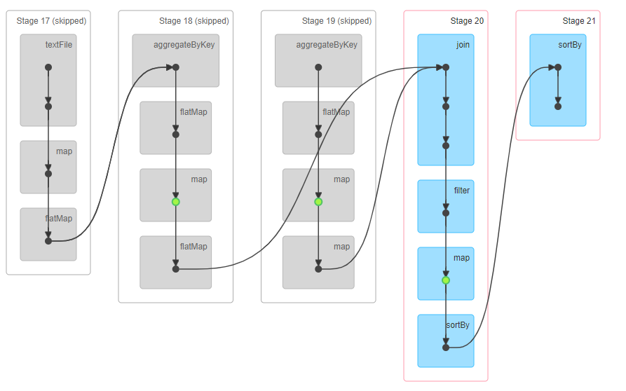
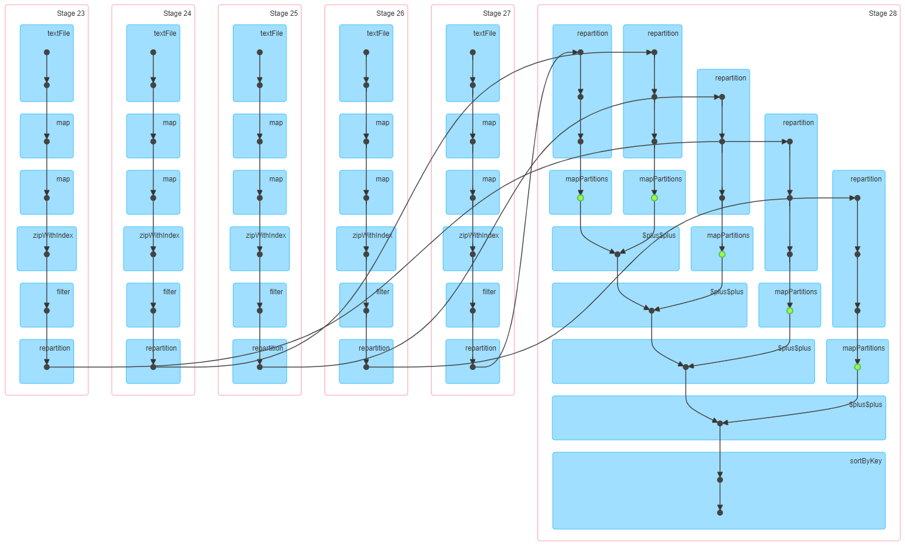

#  面向大数据的高效关联规则推荐算法

## 并行化设计思路和方法

算法首先基于 PFP-Growth 算法,它是一个对于 FP-Growth 算法的基础上使用了 Map-Reduce 的思想进行并行化处理得到的算法。
FP-Growth 算法的基本思路是：

1. 第一次扫描数据库，寻找频繁1-项集，并按照由大到小的顺序排序。
2. 创建FP模式树的根结点，记为 `null`。
3. 根据频繁1-项集的顺序对数据库中的每条事务数据进行排序，并存储在FP模式树中，并建立项头表。
4. 为每一个频繁1-项集寻找前缀路径，组成条件模式基，并建立条件FP树。
5. 递归挖掘条件FP树，获得频繁项集。

对应的伪代码如下：其中DB代表事务数据库，ξ代表最小支持度阈值

```
Procedure: FPGrowth(DB, ξ)
Define and clear F-List : F[];
foreach T ransaction Ti in DB do
foreach Item aj in Ti do
        F[ai] ++;
    end
end
Sort F[];
Define and clear the root of FP-tree : r;
foreach T ransaction Ti in DB do
    Make Ti ordered according to F;
    Call ConstructT ree(Ti, r);
end
foreach item ai in I do
    Call Growth(r, ai, ξ);
end

Procedure: Growth(r, a, ξ)
if r contains a single path Z then
    foreach combination(denoted as γ) of the nodes in
    Z do
        Generate pattern β = γ ∪ a with support =
        minimum support of nodes in γ;
        if β.support > ξ then
            Call Output(β);
        end
    end
else
    foreach bi in r do
        Generate pattern β = bi ∪ a with support =
        bi.support;
        if β.support > ξ then
            Call Output(β);
        end
        Construct β's conditional database ;
        Construct β's conditional FP-tree Treeβ;
        if T reeβ != φ then
            Call Growth(T reeβ, β, ξ);
        end
    end
end
```

PFP-Growth 算法对于数据挖掘中的海量大数据进行分片，采用并行化处理的方式来解决问题。在 FP-Growth 算法的基础上进行了处理：
1. 在存储，上对于在 FP-Growth 算法上巨大的 FP-tree 进行了划分得到更小局部 FP-tree。因此，新的数据可以在内存中直接存放。
2. 在计算上，对于 FP-Growth 的算法进行了并行化处理，尤其是对于递归函数 `Growth()` 进行了并行。
3. 在通信上，对于 FP-Growth 算法的并行中，通过对于数据的合理划分，减少了跨组的交易通信，得到更好的秉性度。
4. 在参数ξ最小支持度阈值上，可以支持很小的阈值。

PFP-Growth 算法的基本步骤如下：
1. **分片** 对于 DB 进行划分，存储在不同的 partition 上。
2. **并行计算** 进行一个 Map-Reduce 的过程。计数不同的 item，每个 mapper 对于一个 DB 的分片计数，reducer 进行合并，结果存储在F-list中。
3. **Item分组** 对于 F-list 中的 item 进行 group 划分为 G-list，每个 G-list 对应一个不同的 gid。
4. **并行 FP-Growth 计算** 这步需要进行1个完成整的 Map-Reduce 的过程。Mapper 对应读取 G-list 中的一个gid，对应得到当前 gid 的交易。Reducer 根据 gid 把交易划分到不同的分片中。在分片中，Reducer 还会对应生成一个局部的 FP-tree。
5. **聚合** 这步聚合步骤4的结果，得到最后的频繁规则。

对应伪代码如下：

```
// The Parallel Counting Algorithm
Procedure: Mapper(key, value=Ti)
foreach item ai in Ti do
    Call Output(hai,0 10i);
end
Procedure: Reducer(key=ai, value=S(ai)) 
C ← 0;
foreach item '1' in Ti do
    C ← C + 1;
end
Call Output(<null, ai + C>);

//The Parallel FP-Growth Algorithm
Procedure: Mapper(key, value=Ti)
Load G-List;
Generate Hash Table H from G-List;
a[] ← Split(Ti);
for j = |Ti| − 1 to 0 do
    HashNum ← getHashNum(H, a[j]);
    if HashNum = Null then
        Delete all pairs which hash value is HashNum
        in H;
        Call
        Output(<HashNum, a[0] + a[1] + ... + a[j]>);
    end
end
Procedure: Reducer(key=gid,value=DBgid)
Load G-List;
nowGroup ← G-Listgid;
LocalF P tree ← clear;
foreach Ti in DB(gid) do
    Call insert − build − f p − tree(LocalF P tree, Ti);
end
foreach ai in nowGroup do
    Define and clear a size K max heap : HP;
    Call T opKF P Growth(LocalF P tree, ai, HP);
    foreach vi in HP do
        Call Output(<null, vi + supp(vi)>);
    end
end

//The Aggregating Algorithm
Procedure: Mapper(key, value=v + supp(v))
foreach item ai in v do
    Call Output(hai, v + supp(v)i);
end
Procedure: Reducer(key=ai, value=S(v + supp(v)))
Define and clear a size K max heap : HP;
foreach pattern v in v + supp(v) do
    if |HP| < K then
        insert v + supp(v) into HP;
    else
        if supp(HP[0].v) < supp(v) then
            delete top element in HP;
            insert v + supp(v) into HP;
        end
    end
end
Call Output(<null, ai + C>);
```

## 详细的算法设计与实现 

### 频繁模式挖掘
对于不同的 item ，作为不同的 key ，进行一个 Map-Reduce 。每个 mapper 对于一个 DB 的分片计数，reducer 进行合并，结果存储在 F-list 中
```scala 
private def genFreqItems(data: RDD[Array[Int]], minCount: Long, partitioner: Partitioner): Array[Int] = {
    data.flatMap(t => t).map(v => (v, 1L))
      .reduceByKey(partitioner, _ + _)
      .filter(_._2 >= minCount)
      .collect()
      .sortBy(-_._2)
      .map(_._1)
}
```

划分 Group item ，根据交易来进行划分

```scala
private def genCondTransactions(transaction: Array[Int], itemToRank: Map[Int, Int], partitioner: Partitioner): mutable.ArrayBuffer[Array[Int]] = {
    val res = mutable.ArrayBuffer.empty[Array[Int]]
    val group = mutable.Set.empty[Int]
    val filtered = transaction.flatMap(itemToRank.get)
    //交易对应为index的形式
    java.util.Arrays.sort(filtered)
    val n = filtered.length
    var i = n - 1
    while (i >= 0) {
      val item = filtered(i)
      val part = partitioner.getPartition(item)
      if (!group.contains(part)) {
        res.append(filtered.slice(0, i + 1))
        group.add(part)
      }
      i -= 1
    }
    res
    //对应交易从多到少的一个划分
    //res是一个根据group的分组，结果是分组后的交易
}
```

在 `org.apache.spark.mllib.fpm.FPGrowth` 的实现中，reducer 直接按 key 聚合，然后在 FP-Tree 中提取频繁模式。

```scala
data.flatMap { transaction =>
  genCondTransactions(transaction, itemToRank, partitioner)
}.aggregateByKey(new FPTree[Int], partitioner.numPartitions)(
  (tree, transaction) => tree.add(transaction, 1L),
  (tree1, tree2) => tree1.merge(tree2))
  .flatMap { case (part, tree) =>
    tree.extract(minCount, x => partitioner.getPartition(x) == part)
  }.map { case (ranks, count) =>
  new FreqItemset(ranks.map(i => freqItems(i)).toArray, count)
}
```

但经测试，这种实现在第一个 `flatMap` 后需要立刻求值（`aggregateByKey` 要求），占用大量内存，且按 key 聚合的性能也不尽理想。因此我们使用下面的优化算法

首先 mapper 对于交易根据 group 的划分来进行不同的组的划分。

```scala
val temp = data.flatMap { transaction =>
    genCondTransactions(transaction, itemToRank, partitioner)
}.mapPartitions {iter =>
    //iter 对应为（txid, index）
    val pair = mutable.Map.empty[Array[Int], Long]
    while(iter.hasNext) {
        val arr = iter.next()
        val value = pair.get(arr)
        if (value.isEmpty) {
            pair(arr) = 1L
        } else {
            pair(arr) = value.get + 1L
        }
        //对应为每个分组的大小
    }
    pair.iterator
    //pair(grouptx,count)
    //tuple (groupid,(grouptx,count))
    //map
}.map(tuple => (partitioner.getPartition(tuple._1.last), (tuple._1, tuple._2)))
```

之后 reducer 对于 FP-Growth 算法中的不同分片的 group 进行合并：

```scala
repartitionAndSortWithinPartitions(partitioner).mapPartitions {iter =>
      //reduce
      val coArr = mutable.ArrayBuffer.empty[(Int, (Array[Int], Long))]
      var pair = mutable.Map.empty[Array[Int], Long]
      var pre = partitioner.numPartitions + 1
      while (iter.hasNext) {
        val tuple = iter.next()
        if (pre > partitioner.numPartitions) {
          pre = tuple._1
          //首个groupid
        } else if (pre != tuple._1) {
            //新的group id
            //corArr(groupid,(groupdtx,count))
          pair.foreach(t => coArr.append((pre, (t._1, t._2))))
          pair = mutable.Map.empty[Array[Int], Long]
          pre = tuple._1
        }

        val arr = tuple._2._1
        //对应的交易，对应某个交易的交易数
        val value = pair.get(arr)
        if (value.isEmpty) {
          pair(arr) = tuple._2._2
        } else {
          pair(arr) = tuple._2._2 + value.get
        }
      }
      pair.foreach(t => coArr.append((pre, (t._1, t._2))))
      coArr.iterator
      //input (groupid,(groupdtx, count))
}
```

对于 reducer 合并后的数据会进行局部FP-Tree的生成：

```scala
.mapPartitions { iter =>
    if (iter.hasNext) {
        val res = mutable.ArrayBuffer.empty[(Int, FPTree[Int])]
        var pre = iter.next()
        var fpTree = new FPTree[Int]()
        fpTree.add(pre._2._1, pre._2._2)
        while(iter.hasNext) {
            val cur = iter.next()
            if (cur._1 == pre._1) {
                //同一组的在同一个子树上
                fpTree.add(cur._2._1, cur._2._2)
            } else {
                //新的子树
                res += ((pre._1, fpTree))
                fpTree = new FPTree[Int]()
                pre = cur
                fpTree.add(pre._2._1, pre._2._2)
            }
        }
        //groupid，tree
        res += ((pre._1, fpTree))
        res.toArray.toIterator
    } else {
        Iterator.empty
    }
}  //reduce
```

最后对于结果进行聚合，其中需要注意的是，只需要获取比阈值大的部分：

```scala
val gen = temp.flatMap{ case(part, tree) =>
    tree.extract(minCount, x => partitioner.getPartition(x) == part)
} //aggregate
gen.map { case(ranks, count) =>
    new FreqItemset(ranks.map(i => freqItems(i)).toArray, count)
}
```


### 关联规则生成

生成关联规则需要从频繁模式中划分一项作为后项，其余作为前项，所有可能的划分构成关联规则候选集。利用 Spark 的 `partition` 算子，可以轻松产生频繁模式的划分，进而生成关联规则候选集。具体代码如下，其产生形如 `(前项, (后项, 前项+后项支持度))` 的候选集。

```scala
val candidates = freqItemsets.flatMap{ itemset =>
    val items = itemset.items
    items.flatMap { item =>
        items.partition(_ == item) match {
            case (consequent, antecedent) if !antecedent.isEmpty => Some((antecedent.toSeq, (consequent(0), itemset.freq)))
            case _ => None
        }
    }
}
```

然后需要将该候选集与频繁模式集进行 `inner join` 获取前项也在频繁模式集中的候选项，并计算它们的置信度(Confidence)，然后筛选置信度满足要求的关联规则。Spark 的 `join` 算子可以对 `Tuple2` 的第一项进行匹配，然后使用 `filter` 和 `map` 算子转换数据。

```scala
candidates.join(freqItemsets.map(x => (x.items.toSeq, x.freq)))
.filter(f => f._2._1._2.toDouble / f._2._2.toDouble >= minConfidence)
.map { case(antecedent, ((consequent, freqUnion), freqAntecedent)) =>
    new AssociationRule(antecedent.toArray.sorted, consequent, freqUnion.toDouble / freqAntecedent)
}
```

受益于 Spark RDD 的延迟执行特性，Spark 可以获知 `candidates` 所进行的后续运算操作，并对执行的 DAG 进行充分优化，因此该代码在实际执行过程中并不会在内存中保存完整的 `candidates` ，而只保存存在匹配的，可以节约大量内存。



### 生成推荐项

根据赛题任务，只需输出每一用户置信度最大的推荐结果，如果置信度最大的项有多个，则给出编号最小的项作为结果，因此可以首先按置信度降序，后项升序对关联规则进行排序，这样后续在进行用户推荐的时候，只需要搜索到第一个匹配规则即可。这里使用 Spark 的 `sortBy` 算子配合自定义 `Ordering` 类完成。

```scala
implicit object AssociationRuleOrdering extends Ordering[AssociationRule] {
  override def compare(x: AssociationRule, y: AssociationRule): Int = {
    if (x.confidence == y.confidence) {
      x.consequent compare y.consequent
    } else {
      y.confidence compare x.confidence
    }
  }
}
val rules = fpModel.generateAssociationRules(0.0).persist(StorageLevel.MEMORY_AND_DISK)
```

因赛题没有指定最小置信度，这里取最小置信度为 `0.0`。

为了并行化批量用户推荐过程，我们首先将已排序的关联规则广播到每一个 `Executor` ，即每个 `Executor` 都持有关联规则集的完整副本，然后每个执行线程对自己的分区内的用户概貌计算推荐项，最后写出。

```scala
val assRulesBroadcast = sc.broadcast(sortedRule)
val userData = sc.textFile(arConf.inputFilePath + "/U.dat", arConf.numPartitionC)
      .map(i => i.trim.split(' ').map(f => f.toInt).sorted).map(i => HashSet(i: _*))
userData.mapPartitions(doUserRec).map(_._2).saveAsTextFile(arConf.outputFilePath + "/Rec")
```

但是我们发现，Spark 按照数据在文件中的位置对数据条目进行自然分区，而用户概貌数据文件中靠前的条目普遍较小而且容易匹配到，靠后的条目普遍较大且较不易匹配到，这造成计算压力分布不均，导致最后存在部分分区执行时间比其他分区长得多，不能充分利用数据划分的并行加速。因此，我们对每一用户概貌条目跟踪其在文件中的位置，然后对数据进行了 `repartition` 将数据随机进行重新分区，这样可使每个分区所需计算时间趋于一致。最后按跟踪的条目位置将结果排序写出，这样可充分利用数据划分的并行能力。

此外，我们还将数据按大小划分为几个部分并分别进行重新分区和计算，更有利于负载均衡。

```scala
val userData = sc.textFile(arConf.inputFilePath + "/U.dat", arConf.numPartitionC)
      .map(i => i.trim.split(' ').map(f => f.toInt).sorted).map(i => HashSet(i: _*)).zipWithIndex()
val splitPoint = Array(25, 50, 100, 500)
val splitRDDs = Array.ofDim[RDD[(Long, Int)]](splitPoint.length + 1)
for (i <- splitRDDs.indices) {
  val filteredRDD = if (i == 0) {
    userData.filter(_._1.size <= splitPoint(0))
  } else if (i == splitRDDs.length - 1) {
    userData.filter(_._1.size > splitPoint(i - 1))
  } else {
    userData.filter(r => r._1.size > splitPoint(i - 1) && r._1.size <= splitPoint(i))
  }
  splitRDDs(i) = filteredRDD.repartition(arConf.numPartitionC)(SizeOrdering).mapPartitions(doUserRec).persist(StorageLevel.MEMORY_AND_DISK)
}

splitRDDs.reduce(_ ++ _).sortByKey().map(_._2).saveAsTextFile(arConf.outputFilePath + "/Rec")
```

在上述代码中，我们发现 `sortByKey` 算子虽然是个 transformation 但是却会触发 event ，导致推荐过程计算两次，因此我们在每个 `splitRDD` 最后加上 `.persist(StorageLevel.MEMORY_AND_DISK)`，以缓存该 RDD 计算结果，避免推荐过程执行两遍。



### 自适应资源使用

我们发现若使用全部可用核心运行 PFP-Growth 算法可能导致堆内存不足，Worker JVM 忙于 GC 而与 Spark 主进程失联，因此我们使用了一种自适应的方法来确定所要使用的并行度，即根据分配的内存和核心数确定实际运行所使用的核心数。

```scala
def adaptiveMemoryStage1(conf: SparkConf, arConf: ARConf): SparkConf = {
    val execCores = conf.getInt("spark.executor.cores", 24)
    val memoryAllocated = conf.getSizeAsGb("spark.executor.memory", "30G")
    val executors = conf.getInt("spark.executor.instances", 1)
    val adaptiveCores = Math.max(Math.min(execCores, memoryAllocated / 8).toInt, 1)
    val partitions = adaptiveCores * executors * 16
    arConf.numPartitionA = partitions
    arConf.numPartitionC = partitions / 16
    val res = conf.clone()
    res.set("spark.driver.allowMultipleContexts", "true")
    res.set("spark.executor.cores", adaptiveCores.toString)
    res
}
```

经测算，我们发现在全量数据集上运行 PFP-Growth 大约需要每核 8G 内存。

在计算推荐项阶段，并没有这么大的内存需求，因此扩大并行度可以提升性能，然而这需要创建新的 `SparkContext`，但这在我们使用的 YARN 集群 Cluster 部署模式中不受支持，且 Spark 3.0 以上也不支持这样的做法，考虑到重新创建 `SparkContext` 存在的种种兼容性问题，我们没有在推荐阶段扩大并行度。

## 实验结果与分析

### 实验环境

实验在虚拟机中运行，配置如下表所示

| 项目     | 值                                   |
| -------- | ------------------------------------ |
| CPU      | 36 x Intel Xeon E5-2680v3 @ 2.50 GHz |
| 内存     | 120G DDR4                            |
| 硬盘     | 128G HDD                             |
| 操作系统 | CentOS 7.9                           |
| Hadoop   | 2.7.3                                |
| Spark    | 2.1.0                                |
| JVM      | OpenJDK 1.8.0_332                    |
| Scala    | 2.10.4                               |

### 实验设置

在上述实验环境下，搭建单副本单节点 HDFS 集群和单节点 YARN 集群，Spark 使用 YARN 调度器，部署模式为 Cluster，运行时为 Spark 任务分配 32 虚拟 CPU 核心，100G 内存。

使用的购物篮数据集为 `webdocs.dat` 全量数据集，用户概貌数据集为 `webdocs_20percent.txt`。分别测试了使用 Spark 原始算法(`org.apache.spark.mllib.fpm.FPGrowth`)和依次加入改进的 PFP-Growth 算法、改进的用户概貌数据重分区方法的情况下程序总执行时间。由于用户概貌数据集没有提供标准答案，测试样本数据集中也没有提供运行参数，故没有计算推荐准确率。运行时并行度由 `Util.adaptiveMemoryStage1` 进行自适应限制，避免内存不足。

挖掘频繁模式的最小支持度为 `0.092` ，生成关联规则的最小置信度在赛题中没有要求，故设置为 `0.0`。

### 实验结果

| 算法配置                               | 执行时间 | 加速比(相对于原始) |
| -------------------------------------- | -------- | ------------------ |
| Spark 原始算法                         | 25279 s  | 1.00               |
| 改进的 PFP-Growth                      | 3467 s   | 7.29               |
| 改进的 PFP-Growth + 用户概貌数据重分区 | 2358 s   | 10.7               |

## 程序代码说明

### 代码组织结构
```
├── README.md // 说明文件
├── build.sbt // SBT配置文件
├── default.properties
├── project
│   ├── META-INF
│   │   └── MANIFEST.MF
│   ├── build.properties
│   └── plugins.sbt
├── report.md
├── sbt
│   └── sbt
└── src //源代码
    └── main
        └── scala
            └── AR
                ├── Main.scala // 主程序
                ├── algorithm 
                │   ├── fpm // PFP-Growth 算法
                │   │   ├── FPGrowth.scala
                │   │   └── FPTree.scala // FP-Tree 数据结构实现
                │   └── rec // 推荐算法
                │       └── UserRecommendation.scala
                ├── config
                │   └── ARConf.scala // 运行时配置
                ├── entity // 实体类
                │   ├── AssociationRule.scala
                │   └── FreqItemset.scala
                └── util // 辅助工具包
                    └── Util.scala
```

### 程序编译方法

在代码根目录(`build.sbt`所在目录)下运行：

```shell
sbt package
```

完成后即可在 `target/scala-2.10` 目录下找到 jar 包。

### 代码运行说明

```bash
spark-submit \
	--master yarn\
	--deploy-mode cluster \
	--class AR.Main \
	--name "AR" \
	--executor-memory 100G \
	--executor-cores 32 \
	--num-executors 1 \
	${JAR_PATH} \
	${INPUT_DATA_DIRECTORY_PATH} \
	${OUTPUT_DATA_DIRECTORY_PATH} \
	${TEMP_DIRECTORY} \
```

本程序假设 `${INPUT_DATA_DIRECTORY_PATH}` 下存有购物篮数据集 `D.dat` 和用户概貌数据集 `U.dat` ，`${OUTPUT_DATA_DIRECTORY_PATH}` 和 `${TEMP_DIRECTORY}` 存在且为空。生成的频繁模式和推荐结果分别保存在 `${OUTPUT_DATA_DIRECTORY_PATH}` 下的 `Freq` 和 `Rec`。

# 附录A 组员和分工

| 学号       | 姓名   | 分工                                   |
| ---------- | ------ | -------------------------------------- |
| SA21011032 | 王永福 | 代码编写、算法优化、数据处理、报告编写 |
| SA21011192 | 张灏文 | 算法调研、FP-Growth 算法优化、报告编写 |
| SA21229063 | 刘紫檀 | FP-Growth 算法实现                     |
| SA21229075 | 陈文博 | 关联规则生成实现                       |
| SA21011180 | 马元一 | 用户推荐实现                           |

